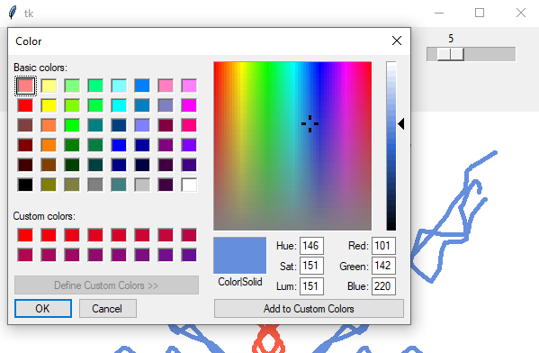

# Kaleidoscopic_Pattern_Generator
Kaleidoscopic Pattern Generator App using Python and Tkinter

This application has paint-like interface wherein user can doodle around on the canvas and while doing so,
the app will automatically generate a symmetrical image of whatever the user has drawn. This will result in 
a myraid of kaleidoscopic patterns, which will unleash the creativity of anyone using it. 

Also, the user can select different colors, change brush size and select upto 2 levels of symmetry.
Moreover, Eraser and Clear Canvas options are also made available to the user.

<h4>Canvas</h4>

<h4>Color Palatte</h4>

<h4>Symmetry Level 1 [01]</h4>

<h4>Symmetry Level 1 [02]</h4>

<h4>Symmetry Level 2</h4>

